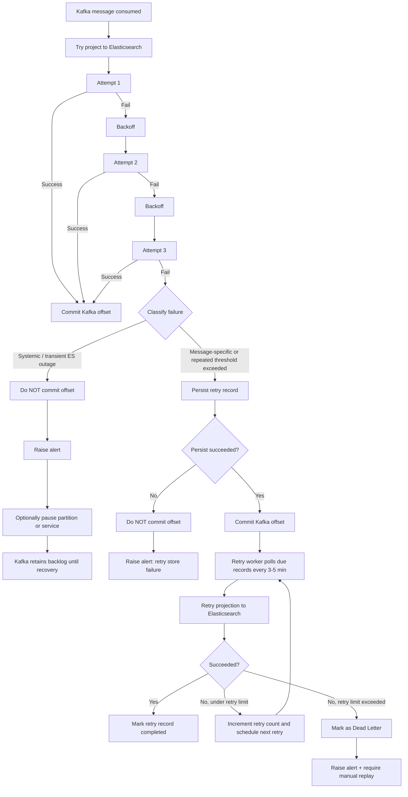

# Catalog Kafka Retry, Retry Store, And Dead-Letter Plan

## Goal

Fully support the agreed Catalog projection flow:

- retry each Kafka message immediately 3 times with exponential backoff;
- commit offsets only after successful projection or successful persistence into retry storage;
- keep Kafka as the main outage buffer for systemic Elasticsearch failures;
- move message-specific or repeatedly failing records into retry storage;
- retry those stored records with a background worker;
- move exhausted retry records into final dead-letter state for manual replay.

This document is the implementation plan for that full behavior.

## Target Flow

1. Consume Kafka message.
2. Attempt projection into Elasticsearch.
3. Retry immediately up to 3 times with exponential backoff.
4. If one attempt succeeds, commit the Kafka offset.
5. If all 3 attempts fail, classify the failure.
6. If the failure is systemic or transient Elasticsearch outage:
   - do not commit the Kafka offset;
   - raise alert;
   - optionally pause the partition or service;
   - let Kafka retain backlog until recovery.
7. If the failure is message-specific or has exceeded the threshold for main-flow retries:
   - persist a retry record;
   - commit the Kafka offset only if persistence succeeds.
8. Retry worker polls retry records every 3 to 5 minutes.
9. If worker retry succeeds, mark the retry record completed.
10. If worker retry keeps failing but is still under the worker retry limit, reschedule it.
11. If worker retry exceeds the larger limit, move it to final dead-letter state and require manual replay.

## Why This Design

Catalog is a read-model projection service. The design must protect correctness first:

- no silent message loss;
- no committing failed projections;
- no infinite hot-loop retries for long Elasticsearch outages;
- no permanently blocked partitions because of one poison message.

The architecture deliberately uses two buffers for different problems:

- Kafka buffers systemic infrastructure outages.
- Retry storage handles message-specific failures that should leave the hot path.

## Failure Classification

The consumer must classify failures after the 3 immediate retries are exhausted.

### 1. Systemic / Transient Infrastructure Failures

Examples:

- Elasticsearch connection refused.
- Timeout talking to Elasticsearch.
- DNS or network failure.
- 429, 502, 503, cluster unavailable, or similar service-level write failures.

Handling:

- Do not commit Kafka offset.
- Raise an alert.
- Optionally pause the assigned partition or all assigned partitions.
- Keep the message in Kafka.
- Resume only after Elasticsearch is healthy again.

### 2. Message-Specific Failures

Examples:

- Invalid payload shape.
- Permanent mapping rejection caused by message content.
- Document content that cannot be indexed without code or data correction.
- A single message that keeps failing while other projections succeed.

Handling:

- Persist the message into retry storage.
- Commit the Kafka offset only after persistence succeeds.
- Let the main partition continue.

### 3. Unknown Failures

Handling:

- Treat as retryable during the 3 immediate attempts.
- After that, use best-effort classification.
- If it looks systemic, keep it in Kafka.
- If it behaves like a message-specific failure, move it into retry storage.
- Always alert because this category needs operational review.

## Main Consumer Requirements

### Immediate Retries

For each consumed Kafka message:

- attempt projection up to 3 times;
- use exponential backoff;
- recommended pattern is 1 second, 2 seconds, 4 seconds with small jitter;
- if any attempt succeeds, commit the Kafka offset.

### Commit Rules

The main consumer must follow these rules strictly:

- Projection success -> commit offset.
- Retry-store persistence success -> commit offset.
- Projection failure with no retry-store persistence -> do not commit offset.
- Systemic Elasticsearch outage -> do not commit offset.

This is the core no-loss guarantee.

### Systemic Outage Handling

If the failure is classified as systemic:

- keep the consumer alive in the Kafka group;
- optionally pause the affected partition or all assigned partitions;
- stop normal processing from paused partitions;
- do not keep retrying the same failing record every second;
- log and alert with topic, partition, offset, event type, and failure reason;
- resume only when dependency health indicates recovery.

### Pause Partition vs Stop Service

Pause partition means:

- consumer stays alive in the group;
- partition ownership is retained;
- Kafka backlog remains on broker;
- resume continues from last committed offset.

Stop service means:

- consumer leaves active processing entirely;
- partitions may rebalance to other instances if such instances exist;
- backlog remains in Kafka.

Operational rule:

- prefer partition pause for temporary Elasticsearch outage;
- stop the service only when intentionally taking the consumer out of service.

## Retry Storage Requirements

Retry storage is required in this design.

Its purpose is:

- remove poison or message-specific failures from the main Kafka hot path;
- preserve failed event data for controlled retry;
- create a visible operational record;
- support eventual dead-letter state and manual replay.

### Recommended Retry Record Fields

Each retry record should store at least:

- unique retry record id;
- event id if available;
- event type;
- Kafka topic;
- Kafka partition;
- Kafka offset;
- Kafka message key;
- payload body;
- headers or essential extracted headers;
- first failure time;
- last failure time;
- retry count;
- next retry at;
- status;
- last error message;
- last error type or classification;
- correlation id / traceparent if available.

### Recommended Status Model

Use an explicit state machine:

- Pending
- InProgress
- Succeeded
- DeadLetter

Optional extra states if useful:

- FailedTemporary
- Ignored

### Persistence Rule

When the main consumer decides a message must move to retry storage:

- persist retry record first;
- only commit Kafka offset after persistence succeeds;
- if persistence fails, do not commit offset and raise alert.

This avoids losing the event between Kafka and the retry store.

## Retry Worker Requirements

The retry worker is in scope for this design.

### Purpose

- poll retry records due for reprocessing every 3 to 5 minutes;
- retry projection outside the Kafka hot path;
- keep poison or long-tail failures from blocking normal partition progression.

### Worker Behavior

For each due retry record:

1. mark or lease the record as being processed;
2. attempt projection into Elasticsearch;
3. if projection succeeds, mark record Succeeded;
4. if projection fails but retry limit is not reached, increment retry count and set a later NextRetryAt;
5. if retry limit is exceeded, mark record DeadLetter;
6. emit alert when the record moves to DeadLetter.

### Worker Retry Policy

Recommended shape:

- main consumer: 3 quick retries;
- retry worker: slower retries every 3 to 5 minutes;
- worker retry limit: larger threshold than main-flow retry, for example 10 to 20 attempts depending on business tolerance.

The worker should not retry indefinitely forever. Final dead-letter is required.

## Dead-Letter Requirements

Dead-letter is in scope for this design.

Dead-letter means:

- automatic retries have been exhausted;
- the event is no longer part of automatic recovery;
- operator action is required.

### Dead-Letter Outcome

When a retry record reaches final failure threshold:

- mark the record DeadLetter;
- persist last error details;
- raise high-signal alert;
- expose the record for manual replay or manual resolution.

### Manual Replay Requirement

The design must support manual replay later, even if replay tooling is built in a later step.

At minimum the stored retry/dead-letter record must preserve enough information to:

- inspect the failed event;
- understand why it failed;
- replay it safely after fixing code, data, or Elasticsearch state.

## Operational Monitoring Requirements

Add visibility for:

- Elasticsearch unreachable / unhealthy;
- consumer lag growth;
- time since last successful Kafka commit;
- number of paused partitions;
- retry-store persistence failures;
- retry queue size;
- oldest pending retry age;
- count of records moved to DeadLetter;
- repeated failures for the same topic-partition-offset or event id.

The team should know not only that Elasticsearch is unhealthy, but also that Catalog projection is no longer advancing.

## Single-Instance Assumption For This Plan

For now, multi-instance retry-store coordination is not the focus.

That means this document assumes:

- Kafka consumer-group behavior handles partition ownership;
- retry worker may initially be implemented for a single active worker instance.

If multi-instance retry processing is added later, the retry store will need:

- row leasing or explicit state transitions;
- lease expiration;
- idempotent replay behavior;
- uniqueness guarantees for retry records.

## Important Tradeoffs

- Kafka is not infinite storage: retention and broker disk still matter during long outages.
- Pausing partitions is appropriate for systemic outages, not poison-message handling.
- Retry storage should not become the default buffer for every broad Elasticsearch outage.
- Dead-letter is necessary to stop infinite worker retry loops.

## Acceptance Criteria

This design is implemented correctly when all of the following are true:

- Each Kafka message is retried immediately up to 3 times with exponential backoff.
- Successful projection commits Kafka offset.
- Systemic Elasticsearch outage does not commit Kafka offset.
- Systemic outage keeps backlog in Kafka and can pause partitions or service.
- Message-specific failure persists a retry record before Kafka offset commit.
- Retry-store persistence failure does not commit Kafka offset.
- Retry worker polls due retry records every 3 to 5 minutes.
- Successful retry-worker projection marks record completed.
- Retry-worker failures under threshold reschedule the record.
- Retry-worker failures above threshold move the record to DeadLetter.
- Dead-letter transition raises alert and preserves manual replay data.

## Mermaid Reference

