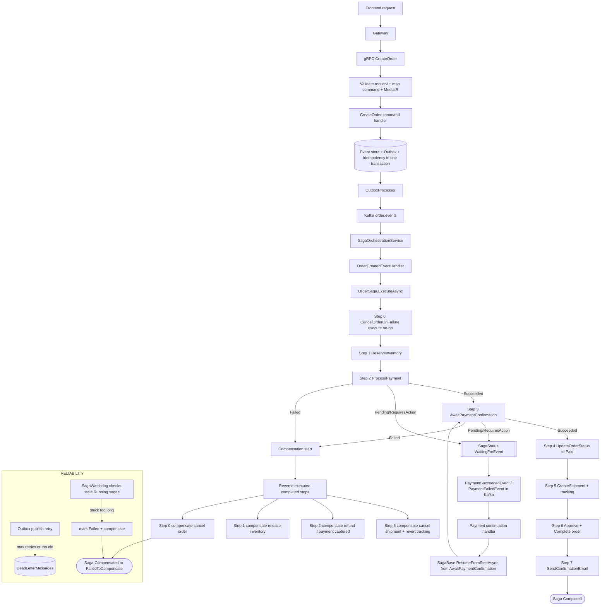

so i ain't gonna lie, this is prettry complex shit

this typical example what opus can't handle. or can...

saga orchestrator with idempotency on every step, long-running saga support (days, weeks), async handlers for continuation, event sourcing with cqrs, event rebuilding, snapshots, ddd with aggregate, background jobs for failed states (like really failed, like me), alarm triggering and other stuff which seems cool....and it is cool, beleave me, i put my life on this saga shit, i handled dozens of use cases, but somethimes you think "why da fuck i have 16 fucking steps to create order?"

so because of this reason i want to describe order service here WITHOUT AI, okEy?

so. create order use-case.
this is penacle of order service.

but before explain step by step how it works i just need to mention core features:
use full saga lifecycle:
- create order
- request return (yeaaa, it's shitty name, but i meanst request return of order which is already completed)
it's just additional stuff on top of "createOrder" saga
- b2b order start
- b2b order updating quote draft
- b2b quote finalization (we map all field from b2b order to order and bg job will handle createOrder saga later)
- b2b order cancelation

recurring order (subscription)
- create 
- execute
- pause
- resume
- cancel

SO. go back to create order lifecycle.

START:
----------use-case--------------

frontend initialize request
then it goes to gateway
then to order microservice gprc layer

------microservice-boudanry--------------

we validate request 
map to command dto
send using mediator

---------application-layer-boundary--------

create order handler "handle" command
call user gateway to check if user exists (actor)
create order and save to db + outbox table


bg job "outbox processor" consume new outbox entity
publish event to kafka

saga orchestration service consume order topic and dispath  event type 
specific handler (finding by event type) start to "handle" => create order saga starts

compensation logic split into 2 layers: step-local rollback and global order cancellation (step 0)
a step can be paused by returning metadata SagaState="WaitingForEvent"
execute sorted steps in sequence
step 0 - no-op success, attempting to cancel order and indident escalation in non-cancellable cases
step 1 - reserve inventory product, release on compensation, create incident ticket if release fails
step 2 - process payment: can succeed/fail/wait, on succeed continue, on pending or require action status,
set WaitForEvent metadata and stops the saga execution, compensation make refund, escalation on compensation failure

----------------------------

kafka bg worker received payment succeed/failed event, trigger specific handler type in saga orchestration service, resume call happens in saga continuation event handler (abstract for all handlers)

----------------------------
step 3 - succeeded continues, failed fails, pending/requiresAction sets WaitingForEvent too, no action on compensation. this step resumes saga
step 4 - marks order paid, no action on compensation
step 5 - creates shipment and assign tracking, cancel shipment on compensation, escalation on compensation failure
step 6 - approve and complete order, no action on compensation
step 7 = sending email, failure doet not fail saga, no action on compensation

END:


--------------------
also saga can stuck in some step, so we have timeout for saga execution which skips saga with "WaitForEvent" status.
dead letter repository is responsible for message delivery reliability in kafka of kafka is death. works for outbox-to-kafka publish reliability
saga watchdog service constantly checking on sagas which have Running state and runs too long. if it's the case
it forces saga to fail + compensation attempt, if compensation fails marks FailedToCompensate

------------------

also we use inbox pattern for read model, but not for whole project


cool as shit visual diagram



## recent fix: payment timeout vs unavailable

issue we fixed:
- previously payment transport errors were handled too generically in create order flow.
- timeout could be treated like hard failure and trigger compensation too early.

how we fixed it:
- differentiate gRPC `DeadlineExceeded` vs `Unavailable` in payment gateway.
- timeout => set saga payment status to `Uncertain` and keep saga in `WaitingForEvent`.
- unavailable => fail payment step and run compensation.
- update await step so `Uncertain` is treated as waiting state.
- cover with unit, integration, and e2e tests for both branches.

Internal IDs: Strongly typed Ids based on Guid (OrderId, CustomerId, ProductId)
External IDs: Use string (PaymentId, TrackingId, ShipmentId, RefundId)

We use Metadata object in saga step result as communication protocol so we can
communicate between steps and saga without need access to saga state (which is violation).
=> Step (child) => we need to wait for webhook, sir
=> Saga () => i will pause for you next step, my boy

### Metadata is a Communication Protocol
```
┌─────────────────┐
│  Step (Child)   │
│                 │
│  "Hey parent,   │
│  I need to wait │
│  for webhook"   │
└────────┬────────┘
│ Metadata
│ ["SagaState"] = "WaitingForEvent"
▼
┌─────────────────┐
│ SagaBase (Parent│
│                 │
│ "OK, I'll pause │
│ the saga for you│
└─────────────────┘
```

for direct approach step should need access to saga state, and this violates all shit
using metadata we signal about shit and saga base class will handle thi shit - event driven saga


it's still one method for everything, but we don't use dispatchProxy via reflection
which is more voodoo than Reagan economic type shit